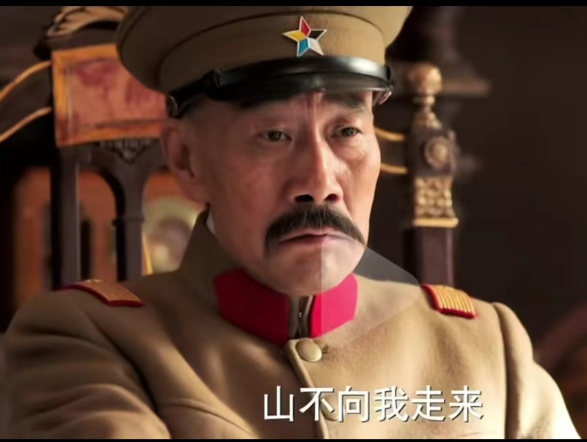
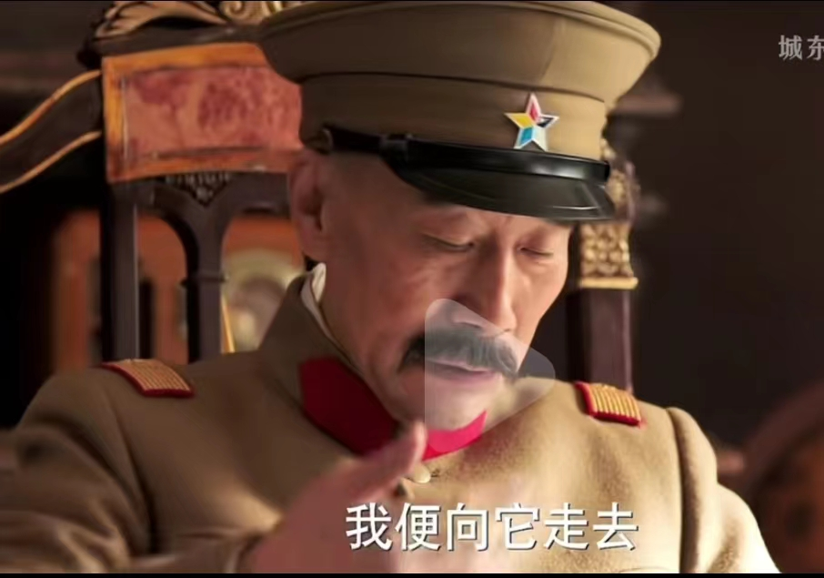

# 马斯克传与我的现实实践

对于所有曾经被我冒犯的人，我只想对你说，我重新发明了电动车，我要用火箭飞船把人类送上火星。可我要是个冷静，随和和普通的人，你们觉得我还能做到这些吗？---马斯克

只有疯狂到认为自己可以改变世界的人才能改变世界---乔布斯

## 1.摘要
马斯克传采用时间顺序介绍马斯克的经历，这样有很好的连贯性。但是也导致在不同方向的上介绍之间联系松散。读者需要自己对整书进行总结归纳。而中文版整书接近60万字。这对于大多数读者无疑是有一定工作量的。
另外阅读马斯克传的大量读者，往往抱有一借鉴的想法，希望通过阅读该书，一窥当今世界科技界最富有的人到底是怎么发展、解决问题的，进而增长自己的见识，甚至提升自己的能力财富地位。这也是人们读书最基本的世俗目的。
本文作者也就是我自己，本科就读于北京航空航天大学宇航学院航天方向，硕士就读于中科院应用天文方向(后申请退学)，后续工作在百度做过L4级别自动驾驶相关核心技术工作，也在机器视觉相关独角兽企业梅卡曼德和旷视科技做过研发工程师和资深软件工程师，在健嘉机器人做过医学软件相关开发，也在清华系相关的安防、基础软件创业公司做过核心研发，还在航天科工从事过相关军工项目研发。所以对国内不论是体制内还是互联网大厂，创业公司都有一定的行业产业从业经验。从航天到基础科研，从重工业制造业到军工，从互联网到AI均有大量实际项目经验。我将结合自己相关经历和书中内容，分析一些现象并做出一些对比。尤其重点剖析在当下国内环境下，马斯克的一些行为到底该如何借鉴。现实中存在哪些坑。最后表达一些我自己的想法，借以结交有理想有能力的优秀人才。

## 2.马斯克的主要成就

马斯克主要的成就如下：

Paypal(美国支付宝)创始人
SpaceX(世界上目前唯一一家可以将人送到空间站，具备可重复运载火箭的私营企业)创始人
Tesla(目前世界上市值最高的电动汽车)创始人
Opanai(推出Chatgpt，引爆新一轮产业革命)联合创始人(后因理念不同退出)
Twitter(世界知名社交媒体)现老板(私有化收购)
Neuralink(脑机接口行业领导者)创始人
SolarCity(家用光伏发电公司)董事会主席
X.AI(对标Openai，刚成立，目前暂无举世瞩目成就达成)创始人
世界首富

## 3.正文

### 3.1.环境---成就事业最基础的保证
我把环境排在第一位，是有深意的。我是一个精英主义者，我一直信奉这个世界向来都是少数精英推动发展的。正是因为如此笃信精英的力量，我才更加深刻的认识到环境的重要性。一个优秀的社会精英，只有找到一个跟自己能力眼界匹配的团体，才能真正去做一些改变世界的事情。如果把他扔到大山深处不通电不通网络的乡镇司法所，他就是拥有世界首富的能力，也没办法突破环境的限制。

马斯克出生于南非。我们试想一下，如果马斯克一辈子只待在南非，以他的个人能力我相信他也可以拥有不少的财富，至少中产以上。但是绝对无法成为这本书的主角，更不能被数以亿计的人去关注。

马斯克小时候的家境属于中产偏富裕。所以至少在教育这块，他的家庭没有给他拖后腿。这样在他小的时候，不论是读书，读大量的书籍甚至百科全书，或者买当时比较贵的电脑学习编程，家里都提供了足够的支持。而同时代的中国，那时候刚开始改革开放，即使当时的万元户也买不起他想要的电脑。

前段时候突然火了一个帖子，说的就是北航最小年级博士生张炘炀现在已经博士毕业了，但是还没有固定工作。他年级轻轻就看到了很多机会，也做出了现在来看非常正确的选择。无奈，却被家里的父母一直拖后腿。出国留学没成，北京买房也没成，最后博士读的也不如意。传统的文化，就算父母做的多么不对，都不允许孩子声讨。这样真的对吗？身处这个大环境中，你能改变你的父母，改变那么多人吗？尤其是一大群中老年人，他们思想早就固化，又不肯学习新的知识思想，却成天觉得自己多么有道理正确，给别人提供错误的建议。

对于18岁之前的教育，不是说就一定要拿什么奥赛全球金牌才叫成功，而是能够顺应人的发展，为其提供必要引导和支持就够了。每个人的自身条件都不一样。天赋更是天差地别。在AI火爆的时候，我看过太多人说自己的兴趣是AI,机器学习。看破不说破，所谓的兴趣背后不都是因为钱多吗？一旦清汤寡水就没兴趣了。说白了对于这种人，压根就不是真兴趣。

而对于马斯克不是这个样子。他在读中学就喜欢编程和游戏，于是自己写游戏玩。他的父母可没花钱找老师去给他造假伪造成果。他在中学，因为自学了很多计算机知识，甚至认为他在这块的造诣不低于大学教授，于是他主动参加学术会议。人家看他年级太小。以为他在胡闹。不让他进去。最后他找他爸爸花钱交会费，并且证明自己的知识水平才被允许参会。而我身边所见却是大量在高校工作的父母，抢自己研究生的成果和论文，往自己孩子身上按。然后去参加小天才比赛啥的。我就读的高中也有学长像马斯克这样，结果人家高考裸分内蒙古状元去了清华。伪造的和货真价实的还是有差别的。而我上大学之前用电脑只打过游戏，连word都不会用。当刚进大学上大学计算机基础课，别的同学都不听的word操作，我却压根跟不上。从来没见过你知道吧！这就是纯纯眼界差距。还拿高中学习物理数学的方法想夯实基础一点点推导呢？就是不明白底层原理所以也不会操作。问老师，老师也说没法教你原理。直到我自学了几十本计算机书籍，写了很多代码之后我才明白整个中国也找不到一个人能把office全部原理花几分钟时间就能讲给我听。甚至连能做出office水平的人都没有！我的失落，迷惘一文不值。

我为什么笃定他不run美国就绝对没有当前成就呢？马斯克是1988年只身前往加拿大读大学的。当他离开母国的时候，南非还是发达国家。整个80年代，南非的社会都在围绕种族主义进行斗争。这种斗争演化成非常激烈的社会动乱。这在自传里面有介绍。如果面对一个连微积分是啥都不知道但是人数却众多的群体，你说你想改变世界，想让火箭重复使用？并指望他们理解你支持你，那是在做白日梦！所以离开非洲是他的大run。

大run让他从南非来到了加拿大。他本来是想直接run美国的。但是没成。所以他当时找了一所加拿大的大学---圣母大学就读。读到一半，他觉得加拿大的环境太过安逸，所以申请转学去宾夕法尼亚大学。从加拿大到美国的小run，才真正为马斯克打好基础。他在宾夕法尼亚大学大学同事学了物理学和经济学。之所以学习经济学他自己说，如果他只学理工科未来只能给别人打工。他最多做一个CTO。但是如果没有公司的掌控权，所谓的CTO无疑只是个高级技术包工头。没有办法真正贯彻自己技术和产品的想法。

马斯克在run到加拿大之后，找过一个银行实习生岗位，在实习期间，他发现了非常好的商机，并且建议上司如何做。但是最后，因为他只是一个实习生，公司不是他的，所以他的建议没有被采纳。当你不是真正的老板，没有那个权利的时候，现实就是这样。即使强如马斯克，也得乖乖的认栽。我想这一点很多打工人都心有体会。所以他后面创建了X.com并合并进去Paypal。去实现自己的想法。坦率来讲，马斯克还是马斯克，只不过因为他职位过于低，没有话语权，照样被无视。没有足够权力资源支持，有再多的想法，眼光多么独到，能力多强都没法实现理想。

所以去寻找一个适合自己发展的环境尤为重要。这是你成就伟大事业最关键的第一步。这一步走错了，后面怎么努力都是错。改变世界已经足够有挑战性了，请别在幻想在自己最弱的时候，还想着铁树开花！

### 3.2.努力---成就事业必不可少的因素
本来在于一个文章受众基本都是中国人的群体讲努力就很没必要。这个群体中最不缺的就是人和努力。可是我依然选择将其放在第二位。

我为什么如此强调努力？

因为一直存在两种看似矛盾实则一致的声音。一拨人在玩命劝年轻人应该努力拼搏，另外一拨人在玩命的宣传躺平。

这两种声音在前两年争论的非常激烈。其实劝你努力的是你的老板，劝你躺平的是你的同事和竞争者。他们劝你的本质都是为了自己获利。而没有考虑你自己。

另外还有人把工厂打螺丝，街头送外卖也划归到努力的范畴。他们的确在努力的为了基本生存活着，但是并不是我这里说的努力去改变世界。

马斯克在本科期间实习，跑到了硅谷暑期实习。从宾州跑到西海岸，相当于横穿美国的距离。他当时有两个实习。白天做超级电容相关，晚上在一家叫做火箭科学的公司做电子游戏。超级电容相关的后续他就创建了特斯拉，而火箭相关的后续他创立了特斯拉。

马斯克就不是一个躺平的人。很多人说他不躺平是因为他有钱。这个理由直接给我整笑了。对于一个财富自由的人，处于基本的人性考虑，也是更容易躺平享受生活才对。马斯克在Paypal拿到自己的投资收益后，就完全财富自由了。就算他闲不下来，也不至于去搞私人火箭这种风险极高的创业项目，毕竟那个时候互联网还有很多的创业机会。有太多平稳赚钱的方式可以让他财富增值，且不需要他太操劳冒险。

他经常在特斯拉、spaceX搞那种不要命的“冒进”。就比如说当时他跟特斯拉的管理层对赌协议，要把特斯拉产量大幅提升。没有人相信他可以做到。于是他几乎住在特斯拉的工厂，不断地检查生产线，排查影响产能的问题，并且快速调集资源修正。他在特斯拉工厂，甚至把相关工程师的工位就放在生产线旁边，以便他们可以快速发现问题结局问题。他在朝着自己的目标努力，即使他早就成为了亿万富翁。

我估计有人读到这里就要开骂了。他努力是因为有足够大的利益。我凭什么努力？可问题是你就是你最大的责任人。我从来没有鼓励你去努力打螺丝活着努力不休息的多跑外卖单。因为上述所谓的努力，只是体力上的累积，你在未来既没有办法跟机器人竞争，你也没办法在当下成倍的提升效率。且这种努力，越努力你留给自己提升成长的时间越少。我将之成为无效的努力。所以我提出的努力从来都不是希望你们像牲口一样做重复的劳动。在未来的智能时代那没有意义。

还有人说很多大老板的一直工作跟很多员工长时间加班工作不一样。大多数员工在工作岗位上机械地加班工作是非常累的。你说的没错，我自己也深有体会。但是当你处于那种环境，是否意味着环境已经不能满足你成长的需求了呢？如果是，怎么应对请看上一条。

我这里说的努力是真正能够提升你们能力眼界，能够让你们在未来更加有竞争力的努力。比如你文化程度很低，没读过大学，但是你能在送外买的间隙学习大学可成，学习微积分。或者你已经工作，你用业余时间去学习新的专业知识，甚至可以做的比该专业的人还好。再或者你读名校，在学习之余参与火箭兴趣小组，借助学校的资助去做一些科学的探索等等。每个人的资源环境不同，做的可能不一样。但是你把必须保持努力。而且这种努力不仅要保持在学习中，最好能融入到你的工作中。所以你要选择你认为有前途的工作，有前途的公司，有前途的岗位，甚至有前提得领导和老板，然后去释放你的这种热情。那么很多人说，我就没这个条件。那你就赶紧提升想方设法跳出去。否则无解。我在大一申请学校学生会面试的时候，面试官问我如果领导安排的事情不是你感兴趣的事情怎么办？我说我只会选择我感兴趣的方向做。然后面试官说现实很多时候不会考虑你的喜好。我说世界从来不缺我一个，我依然会选择我感兴趣的方向。只要我在我感兴趣的方向，我就会投入无限的热忱。我相信自己可以做到卓越。于是我不出意外的落选了。我也明白那个群体不论在学校内还是社会上都不适合我。在错误方向上努力是对彼此的折磨。

我不想灌鸡汤。因为我所说的这些我自己就在切实的做。至于对不对就让时间去验证吧。有一个大体准确的规律就是我们社会发展的越发达，你想去改变世界就会越难，门槛越高。也意味着你需要远超普通人认知的努力。我无意抬杠。至少我亲眼见到的精英没有哪怕一个躺平的。

更何况现在的经济环境能容得下你躺平？

顺便说一下马斯克的那个第一性原理。这个词儿经常被人说到，但是其实并没有太复杂。就是做事情讲究实事求是，只要不违背物理规矩就存在技术改进的可能性。然后以减少成本为目标，优化现有方法。这些东西跟一些学说上说的唯物辩证法道理上是相通的。但是为什么马斯克做到了那么多人做不到的事情呢？归根到底马斯克这么说就真的这么认为，并且这么做。而有太多的人，他们口中的所谓道理他们自己都不信，说一套做一套。尤其在利益纠葛的情况下，实际行为远远超过理论范畴所要求的。不是理论错了，是为了利益硬往歪了念。

在有了第一性原理的前提下，马斯克如果想在高科技领域有所作为，就要去学习这个领域的知识，然后分析该领域存在的问题，进而找到创新点和商机，再招聘大量优秀科技人才去实现这个目标。

这里马斯克的学习跟大多数学生的学习方式是完全不同的。因为他已经财富自由，所以可以花钱找到领域内最优秀的科学家和工程师，直接面聊来讨论学习，然后他再偶尔自己看一些专业的书籍。在SpaceX就是这样，马斯克最开始并不是火箭专业的，而且火箭这个行业本身就是一个大杂烩，需要融合几乎所有的理工科专业。其中对于SpaceX最重要的就是火箭发动机相关技术。不论是早期的猎鹰1还是猎鹰九，在发射中造成失败最多出现问题的地方都是火箭发动机。在这一块马斯克自己看过相关的专业书籍。所以他可以跟工程师直接交流技术问题，甚至可以为相关领域工程师指定研究方向。这是一个很了不起的能力。有很多学物理的人不服气，说他物理水平只有国内物理专业硕士研究生水平。所以你见过那个国内的物理硕士毕业几年内就带着专业火箭团队搞个大火箭上去了？人家有很多努力的地方，你是看不到的。很多人不服气，大英百科全书就在那里放着，你不服气就去翻看嘛。航天的著作中英文的也在那里放着。你不服就去看一下嘛。

相比于在网络上打嘴炮，贬低人家只有宾大物理本科学位，不如自己亲身去做一下呢？我想对于做题深入骨髓的那些人，他们一辈子都理解不了。

另外我这里强调的是努力是事业成功的必要因素。我可从来没说努力就有回报或者努力就有多高的回报率。理解不了充分和必要条件请返回高一学一下。本文再怎么低门槛也有一个微积分门槛呢。

在正确的方向上努力，永远不会错。

### 3.3.自信---山不向我走来我便向它走去
马斯克在加拿大女王大学读书的时候，那时候互联网还没有起来，所以人们获取信息的手段主要是报纸。他和弟弟金博尔会看报纸，然后筛选出他们认为最有趣的人，找到他们的电话，然后由他弟弟打电话进行拜访交谈。甚至邀请对方一起午餐。

这种方式即使在现在也大量存在，尤其在一些2b的公司或者制造业的公司，我经常见到销售要进行这种陌生人拜访，每天都要保证至少拜访多少陌生人。然后从中筛选出有合作意向的，进一步加强关系，逐步打造出自己的销售网络。

真正的人物，我从来没见到过一个是坐在那里一动不动等着机会砸下来的。

在马斯克没有成为全球知名的科技人物之前，有几个人知道他呢？尤其是优秀的人，更是没啥人认识他。所以就应该坐以待毙吗？不是的

马斯克就通过上述方式，认识了尼克尔森，并邀请一起共进午餐。通过共进午餐的这段时间他们讨论了哲学物理学和宇宙的本质。经过交谈，尼克尔森向马斯克发出了要求，提供银行的实习机会。马斯克就是通过这次实习，认识到他不喜欢也不擅长为别人工作，毕恭毕敬不是他的本性，他也不认为大多数人有资格当他的导师。也是在这次实习，让他发现传统的银行业有多么的腐朽。才进一步刺激他后面创建Paypal。当然这位先生对马斯克的作用还不止于此，马斯克在本科毕业之后申请到了斯坦福大学的博士资格，当时有正处于互联网大潮的时代，他面临一个关键的抉择---是继续在大学里面读博士还是在硅谷创业投身互联网浪潮。于是他去找尼克尔森，这位老先生说出的话改变马斯克一生的轨迹。他说如果你未来想读博士，觉得书还没读够，你随时可以回到学校读。但是这场互联网浪潮你错过了，这一辈子就没有了。于是马斯克决定暂时不入学后面彻底没去读博士。也正是这个决定才有了这本书和这篇文章。

我为什么把环境和努力放在自信的前面。通过这个事情就可以反映出了。没有环境，比如他在南非，认识尼克尔森也没有用。没有努力，就算他有自信约到了尼克尔森，他肚子里没有墨水，跟人家谈什么呢？能获得人家的赏识吗？这位尼克尔森先生拥有物理硕士和数学博士学位。正儿八经的高知。这一切基础都是个人努力所奠定的。地基不像地面建筑那么风光，但是没有它的存在，什么楼阁都支撑不住。

当然你有了基础，如果缺乏自信，迈不出这一步，那也是不行的。没有自信，不敢出击，害怕失败，维持面子，机会为什么要找到你呢？是因为你太帅了吗？

山不向我走来，我便向它走去。不只有豪迈又有一丁点无奈。

### 3.4.勇气---不要玻璃心，不要怕冲突
当你有了足够的环境，自己也足够努力为自己进一步发展奠定好了基础之后，你充满自信走出了一地步。你会发现一个新天地。这个世界如此美好。但是请记住一切美好的背后都充满血雨腥风！当你做好了一切准备，要大干一场的时候。各种问题、矛盾、冲突都将接踵而至。你要做的是坚守住自己，并且迎难而上。

马斯克在冲Paypal赚取第一桶金之后，经过一段时间思考，想弄一下廉价航天，把人送到火星。那时候苏联刚解题。大量苏联的核心资产被廉价变卖。所以他跑到莫斯科，想买几发落伍的火箭，自己发射。在莫斯科他被俄罗斯人狠狠地宰了一顿。肆意加价。怎么滴，你不服？毕竟航天从诞生之日起，就都是大国政府玩的东西。从来没有私人公司能玩得动。

在从俄罗斯回美国的路上，他决定自己造火箭。因为他发现火箭如此昂贵，并不是说火箭真的就那么贵，而是旧的体制模式下，不考虑成本因素，大量无效的设计、过度的设计才导致火箭这么贵的。这里面就存疑一个商机，如果他可以把火箭成本降低数倍，就可以在市场上获取竞争优势。客户只需要花费更少的钱就可以完成发射任务。请注意，我这里说的这套商业逻辑只适用于自由市场。如果你在不讲规矩法治的地方，做科技创新降低成本，很有可能被控诉扰乱市场。所以环境问题我才排在第一位。

做出自研火箭是需要勇气的。因为这事基本上可以说前无古人。而且火箭行业属于重资产高风险行业。一旦失败就是倾家荡产。他本可以选择去一些新兴市场国家炒房、金融收割。再不济投资点互联网企业，比如社交平台、电商平台、买菜平台等等都可以很容易赚钱的。我在我的身边，包括我的家人，见到的都是只以金钱为目的。他们做什么事情，从来都没有热爱，也没有理想。啥玩意能更容易搞钱，搞快钱就怎么搞。在他们看来不论你做什么产业，只要是钱，花出去都一样。他们自然没有任何想法去做高风险生意。这就是我为什么把努力放在第二位。诚然赚钱不分行业贵贱，但是你没有足够的知识水平，对于世界上真正先进的事物，你连甚至基本的理解能力都没有的。更不要说在里面寻找商业机会，做硬核高科技创新再把钱给赚了。充其量玩玩去欧洲玩玩足球，买点庄园这种自己能力范围内能理解的事情。就仿佛人类两百多年的工业科技革命从未发生过一样。那他们扔到1800年也不会有啥违和感。

在spaceX的起步阶段，冲突是随时随地存在的。马斯克招聘的工程师在来到这里之前，大多数都是在传统航天公司工作的。他们非常熟悉之前的工作模式。方法论的冲突首先暴露出来。比如SpaceX的火箭发动机需要一个阀门，他们找供应商买，一个25万美金。马斯克针对航天，发明了一个名词叫做愚蠢系数。用当前市场价格和零件原始材料的价格比值来计算。他发现有太多的零件愚蠢系数超过100了。而很懂制造业的他明白这肯定是不合理的。因为他懂工程，也知道基本的物理原理。他知道这个东西压根没这么复杂。所以他让自己工程师自研5000美金就搞定了。这里就涉及努力的作用。如果马斯克没有这样的技术基础，他就没办法区分哪些工程师是真能给他创造价值的，哪些是混子。如果他没法区分工程师水平能力，那么就没办法让工程师自研大幅度降低生产成本。

我听说一些国家大力发展电动汽车产业，给相关企业很多补贴。但是他们造出来的东西不仅贵还不好用。这里面的很多老板都是互联网行业转活来的。咱们不能一棒子打死人，就死板的认为互联网过来的人就不能做好汽车，毕竟马斯克也是互联网过来的。但是区别也就出来了，这些老板对于制造业一点不懂，车身全部外包，自己就做品牌和车上的一些软件。毕竟互联网过来的贴牌和写代码算基本功。准确来讲马斯克一开始也是采用这种外包模式的。那么是什么因素促使他发生改变的呢？

答案即使供应商的产能和产品设计速度跟不上特斯拉速度。需要供应商来协调修改的设计好几个月都做不出来。即使做出来也没办法达到马斯克对产品的要求。所以他才转向自研。而且通过自研，不仅掌握的进度和产品设计自由度，还把成本降下来的。甚至相关生产线的产能也通过掌握在自己手里而不断改进，快速占领市场。

特斯拉在降低成本上的方法论跟SpaceX上用的基本上异曲同工。

这两年全球经济条件不好，很多企业都在提降本增效。我自己也深陷其中。

但是就我所见，他们提的所谓降本增效，只是简单的裁员。原有的工作模式，阻碍公司进步的障碍一个没清除。就拿我上一份工作为例，这家公司在全世界cv领域都非常知名。我刚入职的时候，还是没有固定上下班时间，很欧美方式的管理模式。午休也没有硬性规定。一些福利待遇很好，管理很宽松。过了几个月，开始严抓考勤。规定必须早上九点之前到达公司。午休时间也硬性规定只有中午一个小时。一点就要开始工作。我刚入职那天下午两点去开会，发现路边的椅子上还躺着很多同事呢，现在变成中午一个小时休息时间。再往后就要填写每天工作量，你的工作内容是从那个项目出钱这种了。管理看起来好像越来越严格。但是在一线做研发工作的我，在来这里之前不止做过研发，测试，现场工程师、项目经理、项目负责人我都做过的。我很清楚真正造成低效的原因。但是在公司高层弄得这些措施来看，完全没打到正地方。反倒让人很不舒服。毕竟由俭入奢易，由奢入俭难！只会打击真正有产出人的积极性，混子却照样逍遥磨洋工。因为公司的老板是姚班的，精英中的精英。但是很多时候都只是在高层喊口号，从来没有亲自到一线找问题。尤其很多项目都是工程化项目，真正能够降本增效的方式都在这些细节中。人与人之间，都保持着非常友好的表面关系。没有红脸，没有质疑。只要按照大领导安排好的事情做就好了。

作为对比马斯克在特斯拉和SpaceX没有步入正轨之前，都是经常睡在公司甚至睡在工位上的。因为他是公司大股东，而且亲自担任ceo兼cto。他会质疑为什么生产线上使用机器人做十几分钟都对不准得事情而不直接用人两秒钟就可以做完？事实上我上面说的在公司里面你好我好大家好的风气在特斯拉和SpaceX也大量存在。但是马斯克通过制定超高的任务标准在不断打破这种风气。也因此裁撤了大量不合格的中层管理者。他也从这里真正的获得了对应的收益。把特斯拉和SpaceX都做成全球范围内的领头羊。其实如果仅仅是为了赚钱，他不这么做也可以赚钱。

可是如果你追求的是非凡的事业，是正常人想都不敢想的事情，是担当人类的先驱。那么你就不能做好好先生。

对于所有曾经被我冒犯的人，我只想对你说，我重新发明了电动车，我要用火箭飞船把人类送上火星。可我要是个冷静，随和和普通的人，你们觉得我还能做到这些吗？---马斯克

我这里不是鼓吹996没人性的加班。因为对于很多有点钱和资源的老板们，就算他们的员工24小时不休息，他们的公司也做不大。根源在于老板就没那个实力。眼界不行看不到未来趋势，能力不行，只会做最基本的压榨工时，没能力带人到第一线解决棘手问题。试想一下，想通背景条件，一个老板只知道钻营关系，挑顶下属内斗来稳固自己地位。另一个老板在每一次重大关头都能提出相对合理且有建设性的意见。甚至去承担下属不敢承担的责任。在一个健康自由法治的市场环境下，哪个公司更有发展前景。请原谅我在环境前面加了一大堆限定词汇。没办法，在现实中我个人的切实经历表明缺少任何一个都会造成劣币驱逐良币的事件。好的事物压根发展不起来。事情越做越恶心。

在SpaceX很重要的一个工作方法就是质疑每一个决定。因为传统航天产业的不节制成本做法，大量从中遗留下来的规则都是过时的，错误的，商业不可行的。尤其很多的零件原料，压根没必要使用昂贵的稀有金属做。所以不论是马斯克自己还是他的那些骨干工程师，都大量实践该法则。效果奇佳。

我以前学航天的时候，北航的老师给我们讲，我国的航天型号有两个基本规律，一个是动力先行，一个是十年预研十年研发十年使用。动力先行是因为整个航天系统，目前最大的瓶颈都是在运载能力上。而运载能力核心就是火箭发动机。所以实际投入使用的火箭，其发动机都是很多年前研发的。而整个SpaceX从成立到现在才21年。它是2002年成立的。该公司已经研发了猎鹰九号重型火箭和可回收火箭，还有星链。也就是说中国航天的所谓规则压根不适用于SpcaeX。不仅不适用，而且是远远落后的。

那么国内不也有商业航天公司嘛，能不能对标一下呢？以目前来看是绝无可能。根本原因在于人才。马斯克这种不世出的都不提，就是相关领域的基层研发人才，都不具备这样的能力弹性。国内商业航天公司，前些年基本都不具备真正研发火箭的能力，都是通过去火箭院体制内挖人才组建起来的团队。但是就算搭起来班子，由于火箭很多部件他们都没能力生产，还得去体制内买，很多时候还不卖。那些火箭院的人在体制内，很多零部件不需要他们操心，有整个体制来协调。你真到了私企，能设计出东西，但是没法弄到关键部件。这些敏感部件都是跟军工联系极其紧密的，甚至可以直接用于军事用途。所以这就是一个窘境。所以后来像雷军这样的人出来吹风，希望能给更宽松的环境。体制内才开始做一些专门给商业航天公司研发的组件。所以很多技术上的命脉压根不掌握在商业航天公司自己手里。所以很多商业航天公司现在都很乖巧，很清晰自己的定位。做体制内国家队的补充。也意味着短期不会出现一家商业航天公司有能力在国际上跟SpaceX竞争。

我知道的有不少商业航天公司，最开始还是很有心气的，要做自己的火箭，发射失败几次之后，钱都见底了。只能做一些航天零部件供应商。

所以内部环境没那么好，而且外部环境也很恶劣。美国针对中国在航天领域制裁非常严重，中国公民不被允许去美国的航天企业工作。甚至想卫星仿真工具箱这种仿真软件都对华禁用。我以前开发过STK类似的卫星仿真工具，有空我自己写个开源版本。美国这么干让我实在是很气愤。

存在冲突也就存在对抗。走到这一步不论是言语上伤害还是各种明的暗的小手段就要登场了。

马斯克在Paypal的做事风格让很多人不满意。顺便说一下，Paypal是由原Paypal和X.com合并而来，类似于滴滴合并快递。最开始两家也是烧钱，后面烧不下去了，就在投资人的撮合下合并了。马斯克这边股份多一些。后面很多人对他不满，就在马斯克出去度假的时候联合投资人把他罢免了。给他直接踢出去了。很多公司这种内部斗争都很激烈。尤其当你要做一些正确的事情，必然会触动原有一些人的利益的时候。

我以前在一家手术机器人公司，因为我这个人喜欢裸辞，所以入职之前已经在家里蹲了好久。当然我在家呆着也没闲着，看了很多计算机的书籍。所以当我入职之后，立马就支棱起来。还想着把新学的计算机软件知识用到工作中。我当时心气很高，做就要对标世界第一梯队的医疗产品。软件研发刚入职一半都是从看代码开始嘛。因为我看了很多软件工程的书籍，在我之前的工作中我发现很多程序员压根不遵守编程规范，导致很多不必要的bug耽误进度。所以我自己相信的事情我肯定要坚持做。我就一边看代码，一边把代码里的问题分析出来。两周之后开会展示工作成果，我列了几十项问题并针对每一条写了具体该如何改进。有什么问题危害。改正之后对我们有什么效益。然后恶心的事情就开始了，研发团队所有人都开始躲着我，对接的内容也不管，问什么都不说。我当时觉得我自己没做错，所以没怎么理会他们，只是增加了自己工作量，把他们该负责的自己也接过来。

后面就更扯淡了，把我弄进新的项目组，然后故意弄进来for循环都不会写的人跟我一些写医疗软件。这都是给人做手术的东西，我能容忍这么乱搞？就在这个时候我都是一心一意想把公司的产品做好，下班之后，自己花时间研究国外竞品的产品特性。但是公司给我对接的人呢？一个实习生做了三个月，让他讲一下代码，核心算法折腾一天愣是说不明白。我突然发现，原来他们就是故意在弄我。而领导张口就是我心态不行，闭口就是我的什么问题。人都是他弄得，弄成这个德行，还要赖到我身上？所以当时我直接裸辞了。

自从最近读完马斯克传，我才发现马斯克很多的做事原则跟我是非常类似的。但是因为他手老板，他可以直接把这种不负责的中层和基层员工开除。而我没有这样的权利，只能被这些臭鱼烂虾排挤。类似的事情，大江大河的宋运辉不也遇到了？

从我决定申请退学，进入产业界开始。我给自己的目标就从来不是升级加薪。而是要快速了解企业运行模式，了解技术研发流程，了解项目落地的坑在哪里，了解当前企业发展真正的瓶颈是什么，是什么因素阻碍企业没办法成为美国那些高科技公司的等等。经过在多家公司的实践，我不能说我现在就掌握绝对真理的，但是多少也明白了一些道理。上述的问题也得到了不分解答。

我刚退学的时候读过马斯克的早期传记硅谷钢铁侠封面

我就对他十分崇拜。我也深知想要做到类似的成就需要自己首先付出什么(我清楚处理自己努力付出之外还要有其他的配套，但是我得首先先做到自己这部分够硬)。那时我一点工作经验没有，出去找工作面试别人问项目经验，是零。啥都不会。所以在最开始的第一段工作的时候，我前几个月基本都在公司机器人实验室里度过的。我基本不去工位。螺丝自己拧，机械机械加。软件不懂就看其他清华的同事调试。别人不愿意做的测试脏活累活我来干。后面疯狂出项目，才换来对制造业项目的初步认识。后面又自学编程逐步掌握从项目预研、研发、测试、销售、实施、运行、售后全流程。我甚至自己一个人带着笔记本去现场给央企客户一边谈项目商务谈判，谈完就改需求现场改代码。我当时想的很清楚，如果我图一时舒服，我就没办法真正了解制造业的辛苦和困境。我在研发办公室写代码吹着空调不加班很舒服。但是这样的话，我只能一辈子给别人写代码打工。否则里面什么坑，完全想想不出来。也就没办法开发出更符合客户需求的产品。

看了马斯克传我才发现，可能是由于及几年前看过硅谷钢铁侠，很多做事情的风格已经逐步融入到我的日常了。这套东西用起来我的感受就是，就纯做事情而言，的确效率很高。是真正做事的方法论。但是如果自己没有掌握权力，又没有真正支持你的领导，现实中是很难推进下去的。这不是说情商高低的问题，你情商再高，你动人家蛋糕，就要做好发生进一步冲突甚至升级冲突的准备。马斯克这么做最后做成了，会转化成好产品让消费者买单。但是我目前暂时没办法。我要做很大程度的妥协。

马斯克在平时工作的时候，只要是他身边比较亲近的人，基本都被他狠狠地喷过。很多人一开始受不了。但是坦率的将，只要真的是正确的，那么最后基本都是会带来很好的正向结果。因为能接近他的人，已经有了足够的个人努力，基础能力属性这块都是够用的。

我在现实中，很少碰到像马斯克这样性格的人。尤其在体制内，大家更你你好我好大家好。就算有斗争，也是面和心不和。体制外会更狂野一些，但是也没有马斯克那么狂野。毕竟是自己的买卖才会心疼。甚至有的人，就算是自己的买卖，只要自己能获利就好了，不会在意公司能不能长远发展。以至于去掏空公司成就自己，也是比比皆是。尤其很多去股市圈钱的。创办公司的目的就为了上市圈钱，财富自由。至于产品科技创新，专利论文啥的都可以水。然后就......股民都懂。从根上就是烂的。

很多时候，为了推行切实有效的方法，我认为是不能太软弱的，不能害怕冲突。

我估计有人会质疑，我为什么不在一家公司好好斗一下，须知道在这家公司我裸辞了，到下一家依然会遇到。很多事情是躲不过去的。我对这个问题也思考过很多次。最核心的一点吧，我在发生冲突之后，都会很细心观察老板领导的做法说法。作为一个有一定社会阅历的人，我也知道这些道理。但是直属领导或者老板的态度，让我明白，很多时候也许是我高看他们了。我期望过高了。很多时候，那个岗位作为一个饭碗，一天天挨过去，是没问题。绝大多数人也非常热衷于保住这个饭碗。但是就像我前面说的，我做了这么多，还是希望能够实现自己抱负的。也许当我接下来这个offer的时候的确有很多想法，而且我是一个现实的人，我没有好高骛远地做事情。也不是说一家公司容不下我人家就没发展了。只是彼此的期望都不一样而已。我当然期望能遇到好伙伴，要不我运行这个知乎号写这篇文章干嘛。但是对于一些最核心的东西，我也不愿意跟世界妥协。我能够接受为了目标在有限资源下做一定妥协，但是很多的时候我不妥协只是认为所谓的妥协真的不值。不想把自己买的那么贱。

### 3.5.风险---成就事业的伙伴
有了环境、个人努力、自信、勇气还不够。因为只要你想做伟大是事情，就必然要伴随巨大的风险。想做的事情越大风险越高。风险也是成就事业的必要因素。

风险，我本来不想谈。因为这是做事业的基本常识。但是我发现很多常识也在被忽视。

有的人不希望有任何风险，尤其是作为既得利益者。所以他们会想方设法地破坏一切造成风险的事物。甚至以断送未来发展为代价。也许从他们的角度是值得的吧，但是从公共大众发展角度，这无疑是极其愚蠢的败笔。

比如说航天领域吧，这个行业的确风险很高。马斯克在财务自由之后，创建SpaceX。但是前三次自研火箭发射都失败了。工厂里就剩最后一枚备用火箭了。这个时候公司已经没钱了，工资都发不出来了。一个月之内没有新的投资，火箭发布出去就破产了。这时候是当初把他从Paypal赶走的那些合伙人给他提供了投资，投了2000万美金，才能发出工资，把最后一颗火箭打出去。

我们不能看到现在SpaceX非常风光，几乎垄断了民营航天发射任务，就认为这一切都是很正常的。这是真正的先驱。

就像渤海小吏在他历史题材的视频中讲述的那样。苍天要给你一个厚重的礼物，往往需要对你进行很多考验的，很多时候不到最后一颗鹿死谁手都是不一定的。就比如官渡之战，正面战场曹操已经被打的没有招架之力了，粮食也没了，但是就粮食没了的前夜，许攸来投。这样就可以接到果实了吗？不，作为曹操集团最高的指挥者，他要亲自带着精锐去乌巢偷营的。这事太重，交给谁都担不起。这也是上天对他的考验。你扛不住就成不了。风险极大，很有可能功亏一篑，身首异处。但是赢了就是汉末最大的诸侯。奖励也相当丰厚。再比如说高平陵事件，曹爽手握天子，还有大宏农印，就算斗争，也是有很大优势的。但是上天对你考察，你却只想做一个富家翁。在最后的时刻软了。结果就是别人不会再给你任何机会，全家被灭。曹爽如果反抗，优势那么明显，风险已经很低了，但是这都接不住。而其祖宗曹操是硬在官渡磨出来一个绝杀机会。

故天将降大任于是人也,必先苦其心志,劳其筋骨,饿其体肤,空乏其身,行拂乱其所为,所以动心忍性,曾益其所不能。孟子的这句话很多人都学过。最近在网络上也被骂了。因为很多人说，吃了苦也没起来。这还是充分和必要的条件。吃苦只是必要条件。

这时候就会有人说，这不是歌颂苦难吗？或者有人说，有的人出生就在罗马。人家享福也不需要经历苦难就做到了。这两个观点是不正确的。有人拿普通人的经济条件和富二代作对比。认为富二代没有经历他经历的那些苦难，还更有钱。所以吃苦没用。如果吃苦是能够获得经济利益的充分条件，那么首富应该是一头驴。但是问题是从来也没人说过吃苦是获得成果的充分条件啊。它只是必要条件。如果富二代只是待在他家里给他的遗产里面快活，那么他的确不需要吃什么苦。但是只要他想改变一些社会问题或者在财富上把自己家族更进一步，那么他也要承担远远超过普通人的风险与苦难。我举个例子，如果你是康熙朝的一个地主，只要不发生极其恶劣的天灾动乱，你这个地主之家就可以长期保持很不错的经济条件。即使不奋斗不吃苦。只要别太败家就够了。但是跟雍正争夺皇位的八王爷，他的条件可比你这个地主强太多了。可是他也想更进一步实现自己的理想野心啊。所以就参加皇位争夺。如果他不争，几代之内他的后代经济条件都会远远强于这个普通地主。可是他争了，还失败了。最后自己身死。还被改名阿其那。很多跟着他混的官员都被牵连贬为奴隶。这时候之前经济条件远远高于普通地主的那些人的经济反倒不如地主了。房遗爱他爹可是开国元勋，后面不照样被杀了嘛。如果知道注定被杀的结局，当个地主富家翁一代一代传下去会不会是更好的选择呢？

所以也许很多人出身不一样，但是只要想向上改变当前的地位，都要冒着巨大风险。只不过有的人出身实在过于低微，想要挑战大boss前还得打怪升级。越往后挑战越大，成功后的收益也越大。

所以但凡想做点事情，做点有意义的事情。不论啥出身，都要冒险。要做的事情越大，风险越高，收益越高。

但是就我身边的人，几乎所有人对于风险都是极其恐惧的。这是人的本性。但不是人的全部。

中国传统文化对于海盗，强盗之类的角色历来都是极其鄙视的。因为这类角色风险极高。那种学而优则仕的观念深入人心。就算在梁山占山为王也想在朝廷弄个编制。这在当下的环境下，实在是太常见了。没有改变世界的梦想，一个个麻木的身躯仿佛幽灵般飘荡在各个考场。只为了两个字---稳定。他们没有兴趣看一看外面的世界，更不关心人类的未来，甚至如果没有那个巨大机器的庇护，他们都无法凭借自己在寒风中站立。因为能力不足，便更加畏惧风险，反倒会使风险扩大，逐步超出掌控范畴。

所以很多时候选择直面风险，需要能级勇气结合。风险的背面就是机会。有风险管控意识的好的对的，但是不要把风险妖魔化，惧之如虎。学会与风险为伴。

分享一下我自身的经历，不鼓励大家这么做，只是分享。我前面说过我经常干裸辞这种事情。正常人跳槽都是骑驴找马，还要考虑跳槽高峰期。什么金三银四之类的。我基本不这么做。辞职之后经常性长期不工作，而是选择自己感兴趣的技术方向学习研究。用自己的积蓄为界限，硬逼自己进化。我自己很痛苦，不过的确成长快。就是更容易看不上领导和同事。但是我进职场的目标一直也不是升职加薪。很多时候我都是再往前一步就要被饿死的程度。但是我也深有体会在这种绝境下所爆发的战斗力。

马斯克没有我这么极端，毕竟他刨除科技的外衣，还是一位精明的商人。但是也做了大量类似的事情。比如马斯克经常给特斯拉的工程师提出很多看起来无法实现的要求。对工期要求极为苛刻。在他收购推特后，想把位于萨克拉门拖的服务器搬到波特兰。推特的存储主管就说需要半年以上时间。他要求三个月做不到就卷铺盖走人。当晚他就自己坐飞机去了现场，亲自拆服务器。结果一个月就搬完了。因为马斯克他以前就自己弄过数据中心，他清楚地很。他已经给主管很高的裕度了。当然这么快也存在风险，比如他们没有删除服务器中的数据。所以在服务器运送过程中，他们每个车都装了定位装置。防止数据丢失。这的确存在风险，但是不还是做到了嘛？

我们都知道美国的航天技术独步全球。但是在SpaceX，马斯克让大家质疑每一个美国航天行业的规定。很多这些规定都是过时的。甚至是完全没必要的过度设计。他质疑火箭外壳为什么制造如此困难，成本如此之高。于是直接用不锈钢。结果也没问题啊。这在很多地方，不论是十几万人的大型航天企业还是什么私企创业公司，简直是不可想象的。所以一些航天公司最新的型号ppt明显开始抄袭SpaceX了。他们不敢做这样的创新，但是一旦看到人家做到了，心里就稳了。他们的创新便接踵而至了，各种创新奖项也都评上去了，各种人才帽子也戴上了。还宣传这就是不懂技术的火车头带的好。他们没有风险或者说风险很小，却也注定永远只能走在别人后面。看着人家一骑绝尘。

请善待风险，并学会跟风险做伙伴。

### 3.6.合作---成就事业的另一个伙伴
选择并勇于去面对风险是好事儿。但是这种事一个人做不来，所以需要找到靠谱的伙伴一起前行。不论是在SpaceX负责火箭发动机的穆勒，还是擅长航天业务销售跟政府机构打交道的肖特维尔还是在特斯拉用神经网络做路径规划的史洛夫或者在特斯拉初创时期有重大贡献的斯特劳贝尔。你总是需要合适的伙伴。你需要借助他们的聪明才智实现自己的想法。

这一点是很容易理解的。

但我想从另一方面阐述这个观点，就是裁员。

说实话裁员这个事情很难说，因为你说什么别人骂你社会达尔文主义，如果你后面发展不好，他们更是会骂你活该。很多公众人物对于裁员都是做表面文章，表达同情，不想得罪人。甚至这种想法在公司中也大量存在。不愿意为了原则得罪人。也许你的领导也为了利益不讲原则。就算做也是偷偷地做。裁员之后，立马封锁所有权限。然后给钱走人或者连钱都不给直接跑路。当然还有更恶心的。

裁员有很多原因。我在这里不是鼓吹支持随意裁员。我也不是没有同理心，同情心。

我只阐明一点吧，那就是当公司存在一群人严重阻碍公司发展进步，一定要果决干掉他们。我不怕别人骂我误解我。

马斯克的裁员和开人让我看的很爽。因为他的这些动作都是我想做而因为没有权力资源没办法做到的。

马斯克在SpaceX火箭业务稳定之后，就着手打造卫星互联网通信业务，也就是在乌克兰战场大出风头的星链。他收购了一家位于西雅图的卫星公司。然后就开始发射卫星嘛。但是马斯克发现卫星的产能严重不足，而且卫星造假过高。他一口气把整个卫星公司高层全开了。一个没留。然后带着特斯拉和SpaceX的工程师接管卫星公司。开始按照之前在特斯拉和SpaceX实践出来的方法论，改造卫星设计以及生产流程。最后的结果是他们成功了。卫星成本大幅下降。猎鹰火箭一次发射就可以把几十颗卫星打到轨道。直到现在马斯克自己公司的卫星比几乎所有国家的卫星都多。

可是现实中除了马斯克，我没有见到一位有如此做事魄力的领导。以前我以为是在体制内，是体制限制的。私企追逐利益，总会奔放一些吧。结果我在百度和很多创业公司看到的是几乎所有领导，都没有能力结局问题，而选择利益交换和稀泥。相比而言，体制内还有一些纪律组织管着，至少面子上不敢太扯淡。

就比如说，我在百度自动驾驶的时候，我入职的那个岗位之前有老员工干，也有一个员工在这个岗位干了整整一年了。我当然认为百度的自动驾驶团队技术水平很厉害。但是我进去之后才发现，里面乱的很。偶尔会蹦出来个高水平的，但是大多数人跟跟个螺丝钉一样。ppt这个复盘那个整合的，其实全在原地杵。我当时发现问题跟他们反馈，我就奇了怪了，他们很不开心。仿佛我在砸他们饭碗。里面有技术分享会，我入职第一天就参加了，讨论的技术方向虽然不是我现在岗位的，但是我本来就很多岗位的技术都学过研究过，所以我就直接针对技术细节提出了质疑。而且为了别太刺激别人，我已经在语气态度非常客气了。结果那个同事从此再也不跟我说话了，连吃饭都永远不跟我坐一桌。还让他带的新员工远离我。我当时就在想，即使我不发问没有得罪这样的人，我跟这样的人在一个团队就能互相成就打造出世界水平的科技产品吗？然后我的直接leader给了我老员工的电脑，让我重装系统，因为她忘记了密码。我一想重装系统一晚上就没了，还没有贡献。然后我就绕开登录界面把密码文件打开了。这不就解开了嘛，老员工的各种账号密码我都可以看到。也就花了十分钟。如果按照马斯克的做事原则，我是最符合马斯克要求的员工了。但是我的领导从此之后就给我的小鞋不断。故意找我员工培训的时候安排事情，就按两个按钮的事情。然后让其他员工在工作中使绊子，故意告诉我错误操作。让我直接去删数据库去。

我思考了一下，我清楚他们在我来之前就做的那么乱，肯定就是能力问题。但是他们又不愿意改。还觉得我改就打他们的脸。那么这样下来，我除了跟他们和光同尘之外，我怎么去实现改变世界理想呢？

我面试的时候说的清清楚楚，希望借助百度平台跟google的waymo干一下。就这么搞，我连华为都干不过啊。

你一定要选择合适的人合作。人是最重要的。这个绝对不能凑合。

去年马斯克收购推特之后，就开始考核工程师。他认为就算推特员工一天写3行代码，这么多的工程师一年代码量都够写个操作系统的了。但是他们显然没有做这么多贡献。所以他要筛选出真正做事情的工程师。把混子全开了。如果我有权力，我早就血洗健嘉的北研中心的。至于被一个不会写for循环的c++工程师恶心吗？

圣母心的人你怎么不自己开公司，高薪雇佣神经病做公司高管呢？你的爱心哪里去了？

未经他人苦，休劝他人善！

### 3.7.缺点---谁都无法避免的问题
任何事情都是有两面性的。马斯克的确很厉害。但是不代表他什么都是对的。我们应该学习一个优秀的人，同时绝对不能神化一个人。

马斯克在读大学的时候实习，就发现传统银行的一些问题。当时很无奈，他很卑微。没有决定权。所以在他创建的ZIP2被收购后，他就想做网络银行。他起初成立的是X.com,类似于支付宝。后面跟Paypal合并了。但是名字他一直想改成X，遭到Paypal那边人的反对。因为客户已经对这个品牌产生了依赖，乱改名会导致不必要的麻烦。马斯克早些年喜欢做游戏，游戏开发嘛，最大的平台就是windows。所以他在编程这块比较擅长windows开发，可是Paypal的技术栈是linux。马斯克不愿意改，还把代码重新用windows代码重写。折腾了将近一年，而对很多网络欺诈行为不闻不问。还不听劝。最后Paypal内部一起把他踢出去了。

自信是好事，但是在完全新的领域，借用过往经验到底行不行，很难说。知道行不行了，游戏也就结束了。

他后来收购推特，专门有一次裁员是针对那些跟他不对付的员工的。他把所有跟他不一致的全裁了。甚至还闹出来，前脚把人裁了，后脚发现离开这个员工出了一大堆问题，没人能很快解决。又高薪把人往回聘用。

从他的做事风格来讲，就是在快速试错。所以他非常敲掉试错之后的反馈，快速修正，找到正确的方向。但是他的这种做事方式即使在美国，也让很多人无法接受。

他在接收推特之后，改变了推特的审核规则。对于一些极端言论，不再像之前那样封号，而是不推荐上热搜，没有推送等软方式。这是一个进步。他声称自己支持言论自由，但是在推特上有人说他坏话就把人家封号了。

另外马斯克在特斯拉一直是大力支持自动驾驶业务的，他非常期待robotaxi业务的展开。不过稍微了解一点计算机视觉的朋友都知道，在计算机视觉顶会在自动驾驶议题上，被问及什么时候能实现完全自动驾驶的时候，永远是下一年。年年往下推。至少在现在这个时间节点来看，马斯克对于自动驾驶的商业设想过于乐观了。所以特斯拉推出自动驾驶日，来展示自己在这段时间的进展成果。客观来讲，特斯拉的自动驾驶日展现的成果算得上业界标杆的。自动驾驶各路巨头都十分重视。但是就商业来讲还是不够的。对与错只能等待时间证明。

包括马斯克在工作中批评别人的时候，基本不会在意别人感受。骂完人自己跟没事人一样。这时候他身边是有其他的人来做人际关系润色的角色的。尤其对于一些刚毕业的员工，被他骂完之后，直接受不来辞职了。有所得就必有所失吧。

就像最开头说的

对于所有曾经被我冒犯的人，我只想对你说，我重新发明了电动车，我要用火箭飞船把人类送上火星。可我要是个冷静，随和和普通的人，你们觉得我还能做到这些吗？---马斯克

他的这套至少在美国是走通了的。但是在世界其他地方，尽量要谨慎使用。就像我在前面举的我在百度的例子，你不知道对方是什么样的人。我得罪的仅仅是在我成长路上无关紧要的小角色，所以我不太在意。但是万一得罪真正的关键人物，是否会得不偿失？就像电影中国合伙人或者人民的名义中写的，中国的英雄是可以跪的。也许在不一样的土地上，需要另外一种表现方式，才能起到真正的作用也未可知。

### 3.8.理想---指引你走出温柔乡的明灯
理想也是被说烂的词汇了。但是在这里我们还是确定好，就是有理想是一件好事情，并且理想是有很重要的正面意义的。都则后续的内容您就没必要看下去了。

理想这个东西很虚，但是很多伟大事业，你说没有理想牵引，我是不信的。如果做生意就是为了赚钱，那么什么好赚钱就应该做什么。那么马斯克的火箭生意以及在21世纪初电动汽车的生意都是脑袋进水了。从我们现在这个时间点来看，自动驾驶，人形机器人，脑机接口，强人工智能这些貌似也没看到太大是快速落地机会。前景还是有的。都很有发展前途。哪个能率先突破就不知道了。

不过我从来没见过真正有理想的人，永远只跟着别人屁股后面走。但凡能有点理想，也不至于盯着菜篮子小房子挪不动步。

历史终究是要前进的，窝在那个犄角旮旯出不来，没前途！

### 3.9.想象力---这个时代真正能够让你与众不同的特质

### 3.10.暴力---做大做强就无法绕过的藩篱

